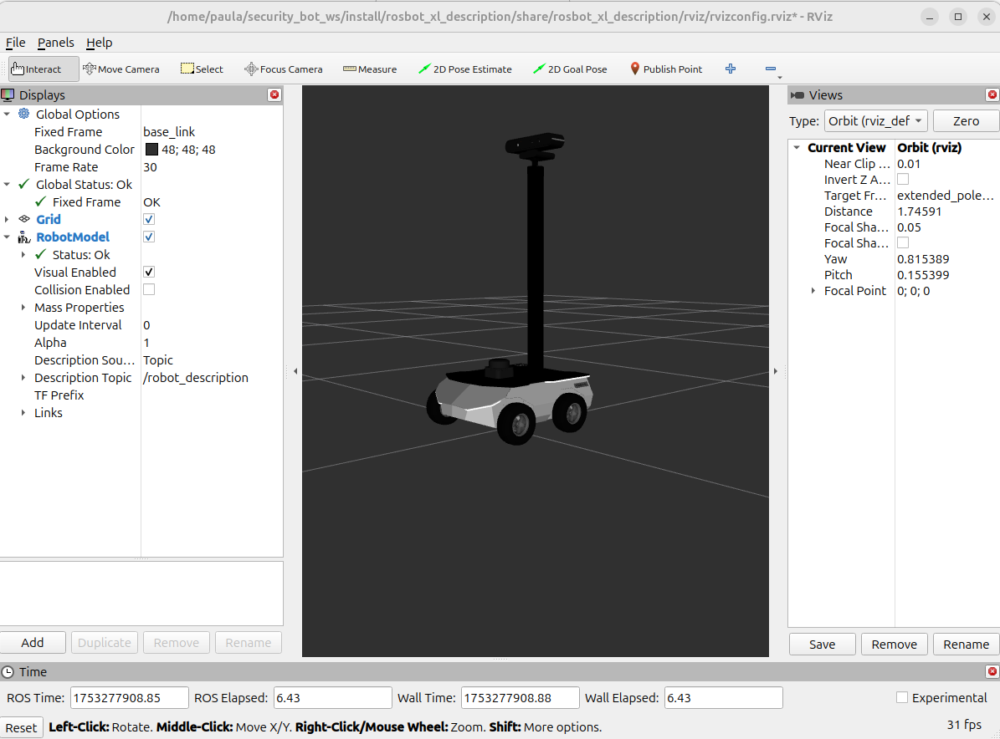
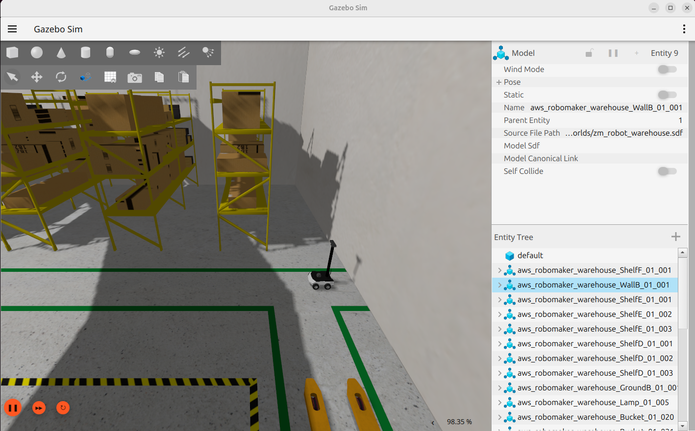
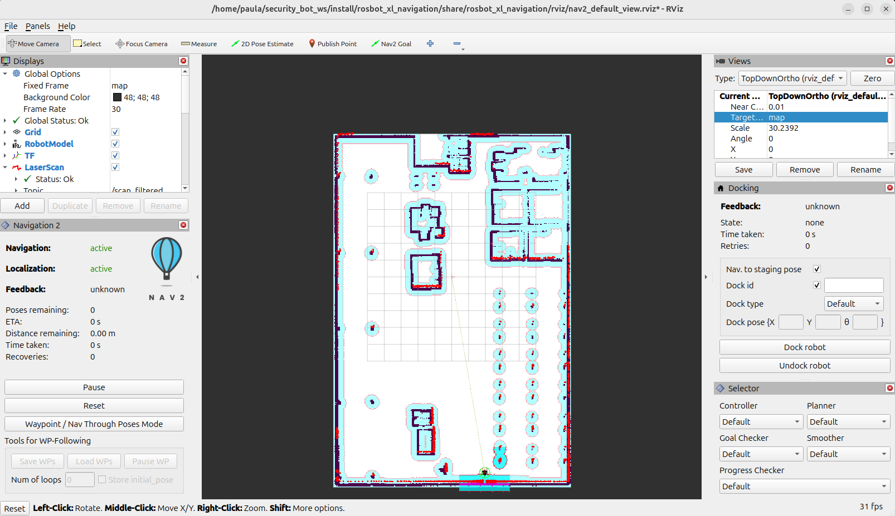
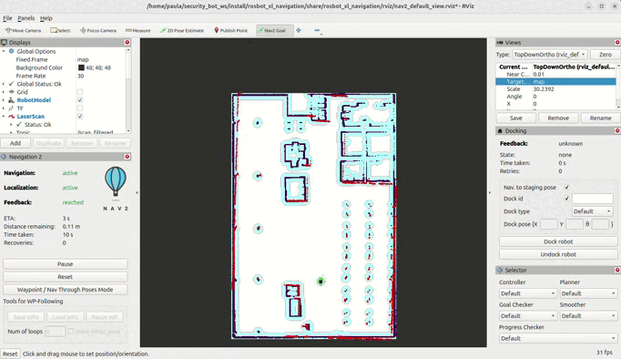
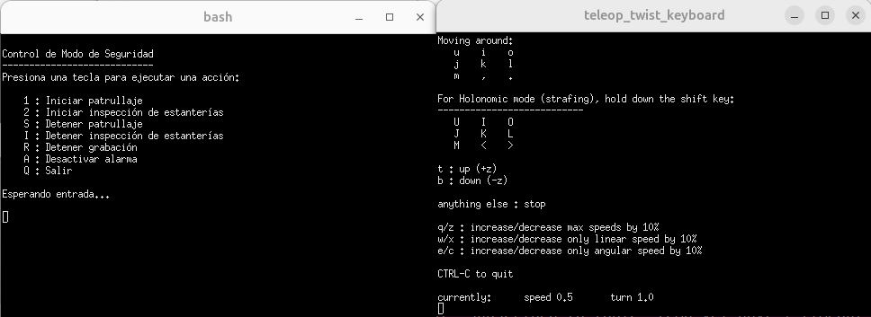
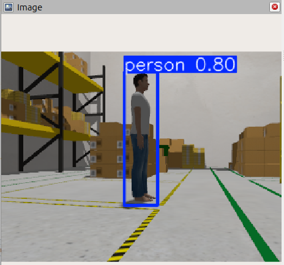
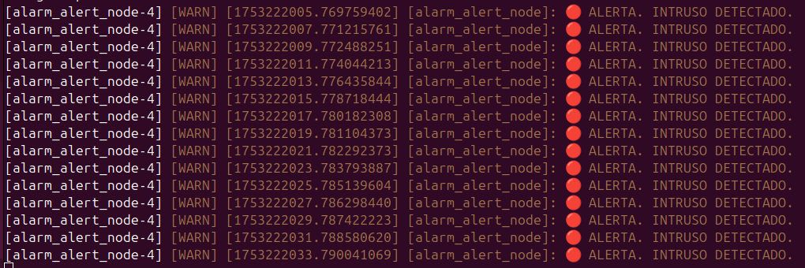

# 🤖 Robot Autónomo para Seguridad y Vigilancia  

Este proyecto forma parte de mi Trabajo de Fin de Grado en Ingeniería Electrónica, y consiste en un **Robot Autónomo para Seguridad y Vigilancia** en un entorno simulado de un almacén. Mediante este sistema, el robot patrulla de forma autónoma un área predefinida. Durante la patrulla, se utiliza un modelo de detección basado en YOLOv8 para identificar la presencia de personas.
Si se detecta una persona durante el recorrido, el sistema activa una alarma visual, y guarda un registro del evento.

Este proyecto utiliza el robot **ROSbot XL de Husarion**, y algunos paquetes han sido extraídos y adaptados desde su repositorio oficial [https://github.com/husarion/rosbot-xl]. El escenario de almacén se ha extraído de el repositorio de **AWS Robotics** [https://github.com/aws-robotics/aws-robomaker-small-warehouse-world]


## 🖥️ Requisitos del sistema
- **Sistema operativo**: Ubuntu 24.04 LTS
- **ROS 2**: Jazzy Jalisco
- **Python**: 3.12
- **Simulación**: Ignition Gazebo

## 📦 Instalación de dependencias
### ROS 2
Para instalar **ROS 2 Jazzy** seguir la guía oficial de instalación: 📎 https://docs.ros.org/en/jazzy/Installation.html

Después, instala los paquetes necesarios:
```bash
sudo apt update
sudo apt install\
  ros-jazzy-slam-toolbox
  ros-jazzy-nav2-bringup
  ros-jazzy-gz-sim
  ros-jazzy-gz-ros2-control
  ros-gz-plugins
  
```
## 🐍 Uso de entorno virtual (opcional pero recomendado)
Para gestionar las dependencias de Python (como `ultralytics`, `torch` u `opencv-python`) de forma aislada y evitar conflictos con otros proyectos o con el sistema, se recomienda el uso de un **entorno virtual (`venv`)**.

### Creación de entorno virtual
```bash
# 1. Crear entorno virtual (hacer este paso solo la primera vez)
python3 -m venv venv

#2. Activar entorno virtual
source venv/bin/activate

#3. Instalar dependencias Python
pip install ultralytics opencv-python torch numpy cv-bridge
```
## 🛠️ Compilar y preparar el workspace
Desde la raíz del workspace, ejecuta:
```bash
colcon build & source install/setup.bash
```

## 👀 Visualización del robot
Para visualizar el modelo del robot y sus sensores en RViz2, sigue los siguientes pasos:
1. Abre una terminal y asegúrate de haber ejecutado el paso anterior.
2. Ejecuta lo siguiente:
```bash
ros2 launch rosbot_xl_description display.launch.py
```
Deberías ver algo como esto:

<p align="center">
  
</p>

## 🌎 Lanzar simulación en Gazebo y navegación con Nav2
Para lanzar simultáneamente el robot en el entorno simulado y activar la navegación autónoma con Nav2, sigue estos pasos:
1. Abre una terminal y asegúrate de haber compilado y preparado el workspace.
### Terminal 1: Lanzar Gazebo
```bash
ros2 launch rosbot_xl_gazebo warehouse_sim.launch.py
```
Deberías ver algo esto:
<p align="center">
  
</p>

### Terminal 2: Lanzar Rviz2+Nav2
⚠️ Importante: Este lanzamiento ya abre RViz automáticamente.
Asegúrate de no tener RViz abierto previamente antes de lanzar este archivo, para evitar conflictos o múltiples instancias.
```bash
ros2 launch rosbot_xl_navigation nav2.launch.py
```
Deberías ver algo esto:
<p align="center">
  
</p>

En la siguiente animación se muestra cómo se utiliza RViz para enviar un objetivo de navegación al robot usando la herramienta "2D Nav Goal". Al hacer clic en el mapa, se define la posición y orientación deseada para que Nav2 planifique y ejecute la ruta automáticamente.

<p align="center">
  
</p>


## 🚀 Sistema de Patrullaje
Este sistema permite gestionar la patrulla de seguridad del robot mediante nodos ROS2 que controlan la navegación autónoma y la supervisión de la misión.

⚠️ Importante: Antes de lanzar este sistema, asegúrate de que no tengas abiertas instancias de Gazebo ni RViz. Tener estas herramientas abiertas puede generar conflictos en la visualización y control del robot.

## Terminal 1: Lanzamiento de Gazebo y Nav2+Rviz
```bash
ros2 launch rosbot_xl_behaviour start.launch.py
```
## Terminal 2: Lanzamiento de Sistema de Patrullaje
```bash
## Activación de entorno virtual
source venv/bin/activate
# Añade la ruta de paquetes del entorno virtual a PYTHONPATH para que Python y ROS2 usen las librerías instaladas dentro del entorno.
export PYTHONPATH=$VIRTUAL_ENV/lib/python3.12/site-packages:$PYTHONPATH

ros2 launch rosbot_xl_behaviour main.launch.py
```
Al ejecutar el launch, se abrirán dos terminales xterm de forma automática:

- Una para la teleoperación manual del robot.

- Otra para el control y supervisión de las funciones autónomas de patrullaje.

<p align="center">
  
</p>


A continuación se muestran ejemplos del resultado de la inferencia visual y del log de alarma al detectar al intruso.

<p align="center">
  
</p>

<p align="center">
  
</p>

